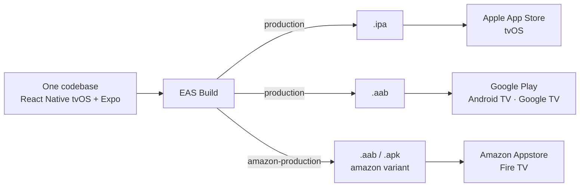

# EWTN+ for TV: a streaming app for three platforms with a single codebase

**How we built the EWTN+ TV app with React Native, what problems we ran into and how we solved them**

- Audience: the team at large (no React Native or TV experience assumed).
- Each slide contains the on-screen content and, below it, speaker notes with suggested timing. Slides are separated with `---` and are numbered and titled.

---

## 1. Cover

**EWTN+ for TV**
A streaming app for three platforms with a single codebase

> **Speaker notes** ⏱ 0.5 min
>
> - Introduce yourself and summarize the talk in one sentence: what we learned building a TV app with React Native for Apple TV, Android TV and Fire TV.
> - Preview the structure: client and context, the technical bet, the challenges, stack assessment and alternatives.

---

## 2. The client: EWTN

- Global Catholic media network: television, radio, news and digital platforms.
- Founded in 1981 in Alabama (USA); broadcasts 24/7 in several languages to audiences around the world.
- Had a legacy TV app with fewer features. Decided to build a new one from scratch.
- EWTN+ product: global live channels, on-demand catalog and the Bible. Profiles, My List, program guide (EPG), search, English and Spanish support.
- Destinations: Apple App Store (tvOS), Google Play (Android TV / Google TV) and Amazon Appstore (Fire TV).

> **Speaker notes** ⏱ 1 min
>
> - Client context: large organization, with a global audience and a very established brand. The figures are public EWTN data and can be adjusted with official numbers.
> - The previous app covered fewer use cases. The goal was a new app, with parity across platforms and accessibility as a requirement.
> - Three stores means three review processes, three artifact formats and three device families.

---

## 3. The bet: a single codebase

- Stack: React Native (`react-native-tvos` fork) + Expo, in TypeScript.
- Each platform requires different build formats, different asset formats and different processes.
- The same code produces:
  - `.ipa` → Apple App Store / TestFlight (tvOS)
  - `.aab / .apk` (Android App Bundle) → Google Play, Amazon Appstore
- Four Android package identifiers (production/staging × Play/Amazon) and one iOS bundle, all from the same tree, resolved through environment variables when the configuration is evaluated.
- Cloud builds and submissions with EAS.
- Ruled out by client decision: two or three native teams with three codebases.

> **Speaker notes** ⏱ 1.5 min
>
> - Why React Native: a single UI, a single team, prior React experience, and a fork (`react-native-tvos`) that adds tvOS and Android TV support on top of React Native. The client imposed this technology, and it seemed logical given their reasoning that code could be reused (in fact everything was structured into shared folders for this reason) for the mobile app, since they expected it to be similar, and even to share with the .com site as well.
> - Formats: Google Play requires App Bundle (`.aab`); Amazon accepts `.apk` and `.aab`. In this project the Amazon staging variant is `.apk` and the production one is `.aab`.
> - The Amazon variant is not a Gradle flavor: it is an environment variable that changes the package identifier and adds the banner required by the Fire TV launcher.
> - Whatever changes per platform at the native level is handled with Expo config plugins, without maintaining `android/` and `ios/` folders by hand.
> - Focus, accessibility and scaling are TV problems that cut across every screen, and in this case every platform.

---

## 4. Challenges

- Navigation, data and state were solved as in any React Native app. The project's cost was concentrated in what is specific to TV and to this stack.
- Five challenges, in order of cost:
  1. **Focus.** On TV there is no pointer or touch: focus is driven by the remote control's D-pad, and what moves it is each OS's native engine (and they behave differently).
  2. **A single codebase for three platforms.** tvOS and Android have many differences in event- and focus-related behavior.
  3. **Screen readers.** VoiceOver and TalkBack double the test matrix and fail in opposite ways across platforms.
  4. **Lack of documentation.** In general there is far less information about developing a TV app than a mobile or web one, and on top of that we used a fork that is poorly maintained and little known.
  5. **Emulators vs physical devices.** Focus, accessibility and performance behave differently on real hardware and emulators.
- These challenges exist in any TV app; in this case, having a single codebase made them even harder to tackle, because solving a problem for one platform could often cause another problem on a different one.

> **Speaker notes** ⏱ 1 min
>
> - Do not go deep on any of them: the goal is for the audience to know what is coming and why it matters.

---

## 5. Focus

- On TV there is no pointer or touch: **focus** moves with the remote control's D-pad.
- What decides where focus goes is each OS's **native engine** (UIKit on tvOS, FocusFinder on Android), based on the layout's geometry.
- Decision: trust the native engine, supported by `TVFocusGuideView` (react-native-tvos API) to bridge and contain regions.
- Recurring symptoms: focus escaping to the side menu during transitions; focus lost after asynchronous loads; initial focus on the wrong element; screens with no focusable element; overlapping elements.

> **Speaker notes** ⏱ 1.5 min
>
> - Mental model: on web or mobile the user points; on TV the system computes the "most reasonable neighbor" in the pressed direction.
> - Complex designs (hero with overlays, collapsible side menu, grids inside rows) are precisely the cases where geometry is ambiguous.
> - Some react-native-tvos APIs were poorly documented and only worked on one of the platforms.
> - The side menu was the big focus magnet: any instant without a focusable element on screen ended with the menu open.
> - Some solutions, always applying the least invasive tool: a focusable placeholder during loading states, imperative focus with retries, locking the side menu during navigation.

---

## 6. A single codebase for three platforms

- The react-native-tvos APIs were supposed to simplify and unify focus handling across the different platforms, but some were poorly documented or only worked on one of the platforms.
- The platforms handle focus and related events differently:

| Aspect        | tvOS (Apple TV)                                                          | Android TV / Google TV                                                                                       | Fire TV         |
| ------------- | ------------------------------------------------------------------------ | ------------------------------------------------------------------------------------------------------------ | --------------- |
| Focus engine  | Infers targets by position and alignment; supports diagonals and swipe   | The system looks for the closest element in the pressed direction (Up, Down, Left, Right), with no diagonals | Same as Android |
| Event order   | The expected one: blur of the previous element, then focus of the new one | Focus of the new element **before** blur of the previous one                                                 | Same as Android |
| Screen reader | VoiceOver                                                                | TalkBack                                                                                                     | VoiceView       |

- Consequence of a single codebase: fixing one platform was prone to breaking another. Many platform-conditional branches to apply different solutions.

> **Speaker notes** ⏱ 1.5 min
>
> - Proximity vs alignment: tvOS heavily weights edge alignment; Android looks for the closest neighbor in the direction. The same layout can be correct on one and ambiguous on the other.
> - Conditional branches for each platform.
> - Different screen reader behaviors.

---

## 7. Screen readers

- On TV, **accessibility focus can differ from interaction focus**: the reader announces the element with accessibility focus.
- Each screen is validated on three platforms × reader on/off.
- Android + TalkBack: `TVFocusGuideView` becomes an accessibility node and captures focus. It has to be replaced with a flat container and the focus traps it provided have to be rewired by hand.
- tvOS + VoiceOver: does not announce when focus is moved programmatically; explicit announcements are required, with delays calibrated per screen, and the reading gets cut off if it coincides with UI updates.
- Virtualization vs reader: to keep TalkBack from skipping items they have to stay mounted, at a performance cost.
- The pacing lever for announcements is the punctuation in the labels.
- Solution: reader state in the focus context; accessible container and Android-specific focus guards; PR policy with four evidence videos (Apple and Android × reader on/off).

> **Speaker notes** ⏱ 1.5 min
>
> - Accessibility doubled the test matrix: every fix had to work with and without the reader, on each platform.
> - The two platforms fail in opposite ways: Android requires removing the component that makes focus work; tvOS requires speaking when the system stays silent.
> - The four-videos-per-PR policy was the most effective process measure against regressions.

---

<!-- one slide for both challenges, which are shorter -->

## 8a. Lack of documentation

- `react-native-tvos` is a fork maintained by few people and with scarce documentation; TV support in Expo is experimental and depends on an environment variable and a config plugin.
- Gaps that had to be covered with our own engineering:
  - `react-native-video` does not report bitrate changes on tvOS or in audio-only streams → custom native modules in Swift and Kotlin, injected with config plugins.
  - Local storage on tvOS can be purged by the system; session tokens live with that risk.
  - Expo dev builds need the mobile launcher intent, which a TV app should not declare → the plugin removes it only in release.
- Method: read the libraries' source code, isolate each divergence in a defensive config plugin (there are seven today) and document in the repo what upstream does not document (~600-line README and per-topic guides).

> **Speaker notes** ⏱ 1 min
>
> - With this stack you have to assume the library's source code is the documentation.
> - Config plugins allow injecting native code without maintaining native folders: they are regenerated on every build and, if the expected file changed, they fail with a warning rather than an error.
> - Hidden cost of "a single codebase": we still had to write Swift and Kotlin. Less than in pure native, but not zero.

## 8b. Emulators vs physical devices

- Apple TV HD (1080p) showed a green vertical line and image rendering errors that the simulator never reproduced.
- Apple TV's VoiceOver can only be tested on a physical device.
- Fire TV has no official emulator: testing is done via `adb` against physical sticks and in a shared remote lab; VoiceView can only be tested on hardware.
- Between the Android TV emulator and a real Google TV, focus timing and the system keyboard's behavior change.
- Performance problems (such as D-pad lag or delays when navigating) only show up on real hardware.
- Practice adopted: at least one physical device per platform from the start; video evidence per PR.

> **Speaker notes** ⏱ 1 min
>
> - Emulators are for developing, not for validating: everything involving focus, screen reader or performance is decided on hardware.
> - The Apple TV HD case is a per-device-model bug, invisible in the simulator and on Apple TV 4K.
> - Fire TV sticks are the most limited hardware and the one that best exposes performance problems.

---

## 9. React Native tvOS + Expo stack: assessment

**Advantages**

- One codebase and a single UI for three stores.
- Expo Router for navigation and EAS for builds and submissions: no local Xcode or Gradle.
- Config plugins to express native divergences without maintaining `android/` and `ios/` folders.
- Usable React Native ecosystem (player, state, validation) and fast iteration with hot reload.

**Disadvantages**

- The fork lags behind React Native and Expo; TV support is fragile.
- Scarce documentation: the libraries' source code is the reference.
- The native focus engine has no JS abstraction: it forces platform conditionals throughout the UI.
- Complex E2E with no mature tooling for TV.

> **Speaker notes** ⏱ 1.5 min
>
> - The assessment is still positive for this client: three stores with a small team would not have been viable in pure native.
> - The cost is concentrated in focus and accessibility; the rest of the app (navigation, data, state) was as productive as on mobile.
> - Freezing dependencies was a deliberate decision to stabilize; the upgrade debt exists and has to be planned for.

---

## 10. Alternatives that could have been evaluated

| Alternative                                                  | Pros                                                            | Cons                                                                    |
| ------------------------------------------------------------ | --------------------------------------------------------------- | ----------------------------------------------------------------------- |
| Pure native (SwiftUI/UIKit + Compose for TV / Leanback)      | Better focus and accessibility; first-party APIs                | Two codebases and two teams; costly feature parity                      |
| Flutter                                                      | One codebase; good rendering performance                        | No official tvOS target; TV focus handled manually                      |
| Kotlin / Compose Multiplatform                               | Shares logic with Android                                       | No tvOS                                                                 |
| Web for TV (Lightning.js, Solid, Vue)                        | One codebase for Smart TV, Fire TV web and consoles             | tvOS does not expose a WebView for App Store apps                       |
| React Native + `react-tv-space-navigation`                   | Focus is computed in JS and behaves the same on every platform  | Gives up native focus and part of the system's accessibility            |
| Other decisions within RN                                    | FlashList instead of FlatList; bare RN tvOS instead of Expo     | More control in exchange for more maintenance                           |

- Reference used for an internal self-audit: Callstack and Amazon's guide on TV development with React Native (2026 edition).

> **Speaker notes** ⏱ 1.5 min
>
> - The decisive constraint is tvOS: it rules out web, Flutter and Kotlin Multiplatform for the App Store.
> - The most interesting alternative within the same stack is a JS spatial navigation library: it removes the differences between focus engines, but shifts accessibility onto the app.
> - With designs that have many overlapping elements, that option deserves a proof of concept before deciding.
> - Emphasize that a couple of months after launching the app to production, a complete guide on TV app development by Callstack and Amazon came out, and we were able to verify that many of the problems that document mentions are exactly the same ones we ran into and, ultimately, managed to solve.

---

## 11. Closing

- One app, three stores, a small team: the bet works, with a cost concentrated in focus and accessibility.
- The native focus engine and screen readers are the real "TV problem"; the rest is conventional React Native development.
- What upstream does not document, the team documents, in code and in guides.

**Questions**

> **Speaker notes** ⏱ 0.5 min
>
> - Close the talk and open for questions.
> - [Connect with the session that comes next, explaining how Suitest helps mitigate all these challenges we faced]

---
