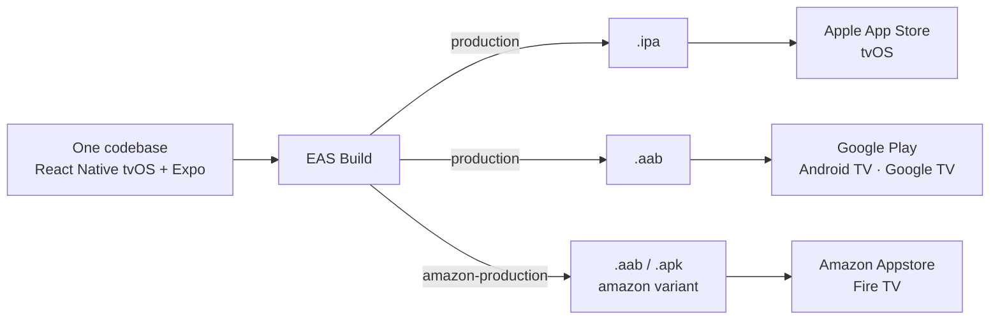
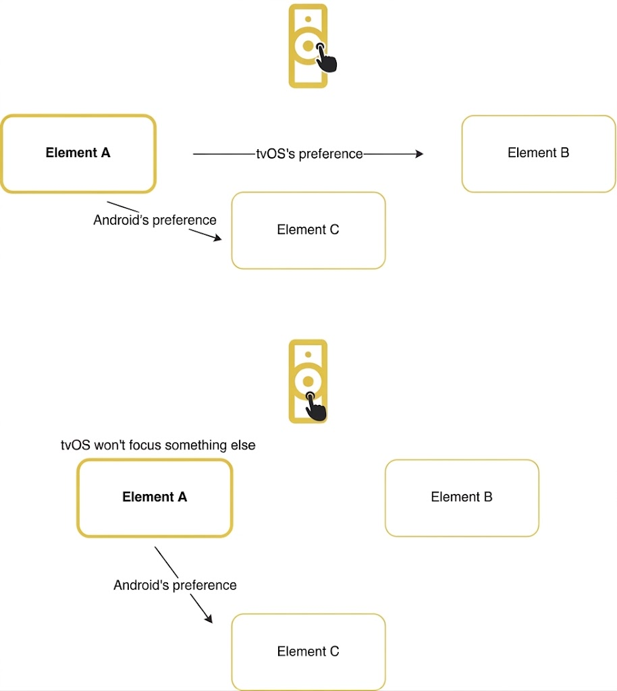

# EWTN+ for TV: a streaming app for three platforms with a single codebase

**How we built the EWTN+ TV app with React Native, what problems we ran into and how we solved them**

- Audience: the team at large (no React Native or TV experience assumed).
- Each slide contains the on-screen content and, below it, speaker notes with suggested timing. Slides are separated with `---` and are numbered and titled.

---

## 1. Cover

**EWTN+ for TV**
A streaming app for three platforms with a single codebase: Apple App Store (tvOS), Google Play (Android TV / Google TV) and Amazon Appstore (Fire TV)

> **Speaker notes** ⏱ 1 min 10s
>
> - Introduce yourself and introduce the team that worked on the project.
> - Summarize the talk and its goal: what we learned and what challenges we faced building a TV app with React Native for Apple TV, Android TV and Fire TV in under 6 months (07/2025 - 01/2026).

---

## 2. The client: EWTN

- Global Catholic media network: television, radio, news and digital platforms.
- Had a legacy TV app with fewer features. Decided to build a new one from scratch.
- Product: EWTN+ global live channels, broadcasting 24/7 in English and Spanish to audiences around the world (US only in the first stage, then world-wide), on-demand catalog and the Bible. Profiles, program guide (EPG), search.

> **Speaker notes** ⏱ 1 min 40s
>
> - Client context: large organization, with a global audience.
> - The previous app covered fewer use cases. The goal was a new app, with parity across platforms and accessibility as a requirement. The idea was to replace the app they already had in the store and ship it as if it were an update; the problem is that they told us this almost at the moment of going to production.

---

## 3. The bet: a single codebase

- Stack: React Native (`react-native-tvos` fork) + Expo, in TypeScript.
- The same code produces:
  - `.ipa` → Apple App Store / TestFlight (tvOS)
  - `.aab / .apk` (Android App Bundle) → Google Play, Amazon Appstore
- Cloud builds and submissions with Expo Application Services (EAS): four Android package identifiers (production/staging × Play/Amazon) and one iOS bundle, all from the same tree, resolved through environment variables when the configuration is evaluated.

> **Speaker notes** ⏱ 2 min 10s
>
> - `react-native-tvos` is a fork of React Native that adds tvOS and Android TV support. Some of its APIs are experimental and it does not support accessibility 100%, so there were things we had to solve with plugins or custom solutions that the fork itself does not provide. Whatever changes per platform at the native level is handled with Expo config plugins [Find examples of this].
> - Why React Native: the client proposed this technology for several reasons: a single UI, a single team with prior React experience (avoiding one team per native app), and the idea of reusing code (everything was structured with an architecture designed for this purpose, in a monorepo with a lot of logic in shared folders) for the mobile app, since they expected it to be very similar, and even to share with the .com site as well.
> - Different build formats accepted by the stores. There are GitHub Actions that trigger the builds [Go deeper into this, how it works today].

---

## 4. Challenges

- Navigation, data and state are solved as in any React Native app. The project's cost was concentrated in what is specific to TV and to this stack.
- Five major challenges:
  1. **Focus handling.** On TV there is no mouse or touch screen: focus is driven by the remote control's D-pad, and what moves it is each OS's native engine (and they behave differently).
  2. **A single codebase for three platforms.** tvOS and Android (even between Google and Amazon devices) have many differences in event- and focus-related behavior.
  3. **Screen readers.** VoiceOver and TalkBack double the test matrix and fail in opposite ways across platforms.
  4. **Lack of documentation.** In general there is far less information about developing a TV app (and specifically about TV accessibility) than a mobile or web one, and on top of that we used a fork that is poorly maintained and little known. AI tools did not contribute much at first, until a more solid base of custom solutions was built for the AI to use as a reference.
  5. **Emulators vs physical devices.** Focus, accessibility and performance behave differently on real hardware and emulators.
- These challenges exist in any TV app; in this case, having a single codebase made them even harder to solve, because solving a problem for one platform could often cause another problem on a different one.

> **Speaker notes** ⏱ 2 min
>
> - Present the challenges in general without going deep: focus and accessibility are TV challenges that cut across every screen, and in this case every platform.

---

## 5. Focus

- On TV there is no mouse or touch screen: **focus** moves with the remote control's D-pad.
- What decides where focus goes is each OS's **native engine** (UIKit on tvOS, FocusFinder on Android), based on the layout's geometry. We decided to trust the native engine, supported by `TVFocusGuideView` (react-native-tvos API) to bridge and contain regions.
- Recurring symptoms: focus escaping to the side menu during transitions; focus lost after asynchronous loads; initial focus on the wrong element; screens with no focusable element; overlapping elements.
  

> **Speaker notes** ⏱ 3 min
>
> - Mental model: on web or mobile the user points; on TV the system computes the "most reasonable neighbor" in the pressed direction.
> - Complex designs (hero with overlays, collapsible side menu, grids inside rows) are cases where geometry is ambiguous, which creates certain focus problems. For example, the side menu was the big focus magnet: any instant without a focusable element on screen ended with the menu open.
> - Solution: custom components, trying to apply the least invasive strategy to avoid race conditions between focus events: a focusable placeholder during loading states, imperative focus with retries, locking the side menu during navigation.

---

## 6. A single codebase for three platforms

- The react-native-tvos APIs that were meant to simplify and unify focus handling across the different platforms were poorly documented or only worked on one of the platforms.
- The different platforms handle focus and related events differently:

| Aspect        | tvOS (Apple TV)                                                           | Android TV / Google TV                                                                                       | Fire TV         |
| ------------- | ------------------------------------------------------------------------- | ------------------------------------------------------------------------------------------------------------ | --------------- |
| Focus engine  | Infers targets by position and alignment; supports diagonals and swipe    | The system looks for the closest element in the pressed direction (Up, Down, Left, Right), with no diagonals | Same as Android |
| Event order   | The expected one: blur of the previous element, then focus of the new one | Focus of the new element **before** blur of the previous one                                                 | Same as Android |
| Screen reader | VoiceOver                                                                 | TalkBack                                                                                                     | VoiceView       |

- Consequence of a single codebase: fixing one platform was prone to breaking another. Many platform-conditional branches to apply different solutions.

> **Speaker notes** ⏱ 2 min
>
> - Proximity vs alignment: tvOS heavily weights edge alignment; Android looks for the closest neighbor in the direction. The same layout can be correct on one and ambiguous on the other.
> - Conditional branches for each platform.
> - Different screen reader behaviors.
> - Three stores means three review processes, three different asset formats, three build formats and three device families that behave completely differently.

---

## 7. Screen readers

- The client requires us to put a strong emphasis on accessibility.
- On TV, **accessibility focus can differ from interaction focus**, and the reader announces the element with accessibility focus. The pacing lever for announcements is the punctuation in the labels.
- Android + TalkBack: `TVFocusGuideView` becomes an accessibility node and captures focus. It has to be replaced with a flat container and the focus traps it provided have to be rewired by hand.
- tvOS + VoiceOver: does not announce when focus is moved programmatically; explicit announcements are required, with delays calibrated per screen, and the reading gets cut off if it coincides with UI updates.
- Virtualization vs reader: to keep TalkBack from skipping items they have to stay mounted, at a performance cost.

> **Speaker notes** ⏱ 2 min 40s
>
> - Since the client is a NON PROFIT organization they needed to go further into accessibility.
> - With the screen reader enabled, focus behavior changes. For example, on Android the screen reader engine hides button capture and stops us from detecting which button is pressed on the remote, which forced us to change strategy to other things like focus guards or nextFocus.
> - Screen reader focus on Android can land on text, but on Apple it cannot, so we had to do workarounds replacing them with pressables so that focus could land on the text.
> - Accessibility doubled the test matrix: each screen is validated on three platforms with and without the reader.
> - The two platforms fail in opposite ways: Android requires removing the component that makes focus work; tvOS requires speaking when the system stays silent.
> - Solution: reader state in the focus context; accessible container and Android-specific focus guards; PR policy with four evidence videos (Apple and Android × reader on/off).

---

## 8a. Lack of documentation

- `react-native-tvos` is a fork maintained by few people and with scarce documentation; TV support in Expo is experimental and depends on an environment variable and a config plugin.
- Gaps that had to be covered with custom solutions:
  - `react-native-video` does not report bitrate changes on tvOS or in audio-only streams → custom native modules in Swift and Kotlin, injected with config plugins.
  - Expo dev builds need the mobile launcher intent, which a TV app should not declare → the plugin removes it only in release.

> **Speaker notes** ⏱ 2m 20s
>
> - With this stack you have to assume the library's source code is the documentation.
> - Solution: divergences between applications had to be isolated with defensive config plugins (there are seven today). Config plugins allow injecting native code without maintaining native folders: they are regenerated on every build and, if the expected file changed, they fail with a warning rather than an error.

## 8b. Emulators vs physical devices

- Apple TV HD (1080p) showed a green vertical line and image rendering errors that the simulator never reproduced.
- Apple TV's VoiceOver can only be tested on a physical device.
- Fire TV has no official emulator: testing is done via `adb` against physical sticks; VoiceView can only be tested on hardware.
- Between the Android TV emulator and a real Google TV, focus timing and the system keyboard's behavior change.
- Performance problems (such as D-pad lag or delays when navigating) only show up on real hardware.

> **Speaker notes** ⏱ 3 min 30s
>
> - Emulators are for developing, not for validating: everything involving focus, screen reader or performance is decided on hardware.
> - The Apple TV HD case is a per-device-model bug, invisible in the simulator and on Apple TV 4K.
> - Fire TV sticks are the most limited hardware and the one that best exposes performance problems.
> - Solution: at least one physical device per platform from the start; video evidence per PR, which makes development heavier because every change requires the developer to test on the physical devices.

---

## 9. React Native tvOS + Expo stack: assessment

**Advantages**

- One codebase and a single UI for three stores.
- Expo Router for navigation and EAS for builds and submissions: no local Xcode or Gradle.
- Config plugins to express native divergences without maintaining `android/` and `ios/` folders.
- Usable React Native ecosystem (player, state, validation) and fast iteration with hot reload.
- The whole team had prior React experience.
- With the initial idea, the stack would give us an advantage in reusing a lot of business logic with the future mobile app.

**Disadvantages**

- The fork lags behind React Native and Expo; TV support is fragile.
- Scarce documentation.
- The native focus engine forces platform conditionals throughout the UI.
- Complex E2E testing.

> **Speaker notes** ⏱ 1 min 20s

---

## 10. Alternatives that could have been evaluated

| Alternative                                             | Pros                                                           | Cons                                                         |
| ------------------------------------------------------- | -------------------------------------------------------------- | ------------------------------------------------------------ |
| Pure native (SwiftUI/UIKit + Compose for TV / Leanback) | Better focus and accessibility; first-party APIs               | Two codebases and two teams; costly feature parity           |
| React Native + `react-tv-space-navigation`              | Focus is computed in JS and behaves the same on every platform | Gives up native focus and part of the system's accessibility |
| Other decisions within RN                               | FlashList instead of FlatList; bare RN tvOS instead of Expo    | More control in exchange for more maintenance                |

> **Speaker notes** ⏱ 1.5 min
>
> - The decisive constraint is tvOS: it rules out other existing options such as Web for TV (Lightning.js, Solid, Vue) and Flutter.
> - The most interesting alternative within the same stack is a JS spatial navigation library: it removes the differences between focus engines, but shifts accessibility onto the app. With complex designs like the ones we had, with overlapping elements, that option deserves a large proof of concept before deciding.

---

## 11. Closing

- One app, three stores, a small team: the bet works, with a cost concentrated in focus and accessibility.
- The native focus engine and screen readers are the real "TV problem"; the rest is conventional React Native development.
- What upstream does not document, the team documents, in code and in guides.
- E2E testing with Suitest to help detect any kind of instability in time.

**Questions**

> **Speaker notes** ⏱ 1 min 30s
>
> - Close the talk and open for questions.
> - The assessment is still positive: today the app is in production, and three stores with a small team would not have been viable in pure native.
> - The cost is concentrated in focus and accessibility; the rest of the app (navigation, data, state) had no major issues.
> - A few months after launching the app to production, a complete guide on TV app development by Callstack and Amazon came out, and we were able to verify that many of the problems that document mentions are exactly the same ones we ran into and, ultimately, managed to solve.
> - Freezing dependencies was a deliberate decision to stabilize; every dependency update broke components and focus. It has to be planned for, but first a solid E2E base has to be established.
> - [Connect with the session that comes next, explaining how Suitest helps mitigate all these challenges we faced]

---
