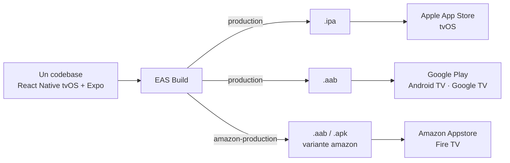

# EWTN+ para TV: una app de streaming para tres plataformas con un solo codebase

**Cómo construimos la app de TV de EWTN+ con React Native, qué problemas encontramos y cómo los resolvemos**

- Audiencia: equipo en general (no se asume experiencia en React Native ni en TV).
- Cada slide trae el contenido para pantalla y, debajo, notas del orador con tiempo sugerido y se separan con `---` y están numeradas y tituladas.

---

## 1. Portada

**EWTN+ para TV**
Una app de streaming para tres plataformas con un solo codebase

> **Notas del orador** ⏱ 0,5 min
>
> - Presentarse y resumir la charla en una frase: qué aprendimos construyendo una app de TV con React Native para Apple TV, Android TV y Fire TV.
> - Adelantar la estructura: cliente y contexto, la apuesta técnica, los desafíos, balance del stack y alternativas.

---

## 2. El cliente: EWTN

- Red católica global de medios: televisión, radio, noticias y plataformas digitales.
- Fundada en 1981 en Alabama (EE. UU.); emite 24/7 en varios idiomas a audiencias de todo el mundo.
- Tenía una app de TV legacy con menos funcionalidades. Decidió construir una nueva desde cero.
- Producto EWTN+: señales en vivo globales, catálogo on demand y la Biblia. Perfiles, Mi Lista, guía de programación (EPG), búsqueda, soporta inglés y español.
- Destinos: Apple App Store (tvOS), Google Play (Android TV / Google TV) y Amazon Appstore (Fire TV).

> **Notas del orador** ⏱ 1 min
>
> - Contexto del cliente: organización grande, con audiencia global y una marca muy establecida. Los datos son públicos de EWTN y se pueden ajustar con cifras oficiales.
> - La app anterior cubría menos casos de uso. El objetivo fue una app nueva, con paridad entre plataformas y accesibilidad como requisito.
> - Tres tiendas implica tres procesos de revisión, tres formatos de artefacto y tres familias de dispositivos.

---

## 3. La apuesta: un solo codebase

- Stack: React Native (fork `react-native-tvos`) + Expo, en TypeScript.
- Cada plataforma exige distintos formatos de build, distintos formatos de assets y distintos procesos.
- El mismo código genera:
  - `.ipa` → Apple App Store / TestFlight (tvOS)
  - `.aab / .apk` (Android App Bundle) → Google Play, Amazon Appstore
- Cuatro identificadores de paquete Android (producción/staging × Play/Amazon) y un bundle iOS, todos desde el mismo árbol, resueltos por variables de entorno al evaluar la configuración.
- Builds y envíos en la nube con EAS.
- Descartado por decisión del cliente: dos o tres equipos nativos con tres bases de código.

> **Notas del orador** ⏱ 1,5 min
>
> - Por qué React Native: una sola UI, un solo equipo, experiencia previa en React, y un fork (`react-native-tvos`) que agrega soporte de tvOS y Android TV sobre React Native. El cliente impuso esta tecnología y parecia logica con sus fundamentos de que se iba a poder reutilizar codigo (de hecho todo se estructuro en carpetas compartidas por este motivo) para la aplicación móvil, ya que pensaban que iba a ser similar, e incluso para compartir tambien con .com.
> - Formatos: Google Play exige App Bundle (`.aab`); Amazon acepta `.apk` y `.aab`. En este proyecto la variante Amazon de staging es `.apk` y la de producción `.aab`.
> - La variante Amazon no es un flavor de Gradle: es una variable de entorno que cambia el identificador de paquete y agrega el banner que exige el launcher de Fire TV.
> - Lo que cambia por plataforma a nivel nativo se resuelve con config plugins de Expo, sin mantener carpetas `android/` e `ios/` a mano.
> - Foco, accesibilidad y escalado son problemas de TV que atraviesan todas las pantallas, y en este caso todas las plataformas

---

## 4. Desafíos

- Navegación, datos y estado se resolvieron como en cualquier app React Native. El costo del proyecto se concentró en lo que es específico de TV y de este stack.
- Cinco desafíos, en orden de costo:
  1. **El foco.** En TV no hay puntero ni touch: el foco es manejado con el D-pad del control remoto, y quién lo mueve es el motor nativo de cada OS (que actuan distinto).
  2. **Un solo codebase para tres plataformas.** tvOS, y Android tienen muchas diferencias en cuanto a comportamientos relacionados a eventos y foco.
  3. **Lectores de pantalla.** VoiceOver y TalkBack duplican la matriz de pruebas y fallan de forma opuesta entre plataformas.
  4. **Falta de documentación.** En general hay muchas menos informacion sobre desarrollo de una App para TV que para mobile o web, ademas usamos un fork poco mantenido y conocido.
  5. **Emuladores vs dispositivos físicos.** Foco, accesibilidad y rendimiento se comportan diferente entre hardware real y emuladores.
- Estos desafíos existen en cualquier app de TV, en este caso al tener un solo codebase fueron mas dificiles aun de llevar a cabo porque generalmente solucionar un problema para una plataforma podía causar otro problema en otra.

> **Notas del orador** ⏱ 1 min
>
> - No profundizar en ninguno: el objetivo es que la audiencia sepa qué viene y por qué importa.

---

## 5. El foco

- En TV no hay puntero ni touch: el **foco** se mueve con el D-pad del control remoto.
- Quién decide a dónde va el foco es el **motor nativo** de cada OS (UIKit en tvOS, FocusFinder en Android) a partir de la geometría del layout.
- Decisión: confiar en el motor nativo apoyado en `TVFocusGuideView` (API de react-native-tvos) para puentear y contener regiones.
- Síntomas recurrentes: foco que escapa al menú lateral durante transiciones; foco perdido tras cargas asíncronas; foco inicial en el elemento equivocado; pantallas sin ningún elemento focuseable; elementos superpuestos.

> **Notas del orador** ⏱ 1,5 min
>
> - Modelo mental: en web o móvil el usuario apunta; en TV el sistema calcula el "vecino más razonable" en la dirección pulsada.
> - Los diseños complejos (hero con overlays, menú lateral colapsable, grillas dentro de filas) son justo los casos donde la geometría es ambigua.
> - Algunas APIs de react-native-tvos estaban mal documentadas y funcionaban solo en una de las plataformas.
> - El menú lateral fue el gran imán de foco: cualquier instante sin un elemento focuseable en pantalla terminaba con el menú abierto.
> - Algunas soluciones aplicando siempre la herramienta menos invasiva: un placeholder focuseable durante los estados de carga, foco imperativo con reintentos, bloqueo del menú lateral durante la navegación

---

## 6. Un solo codebase para tres plataformas

- Las APIs de react-native-tvos se suponía que venían a simplificar y unificar el tratado del focus para las distintas plataformas, pero algunas estaban mal documentadas o funcionaban solo en una de las plataformas
- Las plataformas manejan el foco y los eventos relacionados de forma distinta:

| Aspecto            | tvOS (Apple TV)                                                       | Android TV / Google TV                                                                                                 | Fire TV           |
| ------------------ | --------------------------------------------------------------------- | ---------------------------------------------------------------------------------------------------------------------- | ----------------- |
| Motor de foco      | Infiere destinos por posición y alineación; admite diagonales y swipe | El sistema busca el elemento más cercano en la dirección presionada (Arriba, Abajo, Izquierda, Derecha) sin diagonales | Igual que Android |
| Orden de eventos   | El esperado: blur del anterior, luego focus del nuevo                 | Focus del nuevo **antes** que blur del anterior                                                                        | Igual que Android |
| Lector de pantalla | VoiceOver                                                             | TalkBack                                                                                                               | VoiceView         |

- Consecuencia de un solo codebase: arreglar en una plataforma era propenso a romper otra. Muchas ramas condicionales por plataforma para aplicar distintas soluciones.

> **Notas del orador** ⏱ 1,5 min
>
> - Proximidad vs alineación: tvOS pondera mucho la alineación de bordes; Android busca el vecino más cercano en la dirección. Un mismo layout puede ser correcto en uno y ambiguo en el otro.
> - Ramas condicionales para cada plataforma.
> - Distintos comportamientos de los lectores de pantalla.

---

## 7. Lectores de pantalla

- En TV, **el foco de accesibilidad puede diferir del foco de interacción**: el lector anuncia el elemento con foco de accesibilidad.
- Cada pantalla se valida en tres plataformas × lector activado/desactivado.
- Android + TalkBack: `TVFocusGuideView` se convierte en un nodo de accesibilidad y captura el foco. Hay que reemplazarlo por un contenedor plano y recablear a mano las trampas de foco que aportaba.
- tvOS + VoiceOver: no anuncia cuando el foco se mueve por código; se requieren anuncios explícitos, con demoras calibradas por pantalla, y la lectura se corta si coincide con actualizaciones de UI.
- Virtualización vs lector: para que TalkBack no salte ítems hay que mantenerlos montados, con costo en rendimiento.
- La palanca de ritmo en los anuncios es la puntuación de las etiquetas.
- Solución: estado del lector en el contexto de foco; contenedor accesible y guardas de foco específicas de Android; política de PR con cuatro videos de evidencia (Apple y Android × lector on/off).

> **Notas del orador** ⏱ 1,5 min
>
> - La accesibilidad duplicó la matriz de pruebas: cada fix debía funcionar con y sin lector, en cada plataforma.
> - Las dos plataformas fallan de forma opuesta: Android exige quitar el componente que hace funcionar el foco; tvOS exige hablar cuando el sistema calla.
> - La política de cuatro videos por PR fue la medida de proceso más efectiva contra regresiones.

---

<!-- una Slide para ambos desafios que son mas cortos -->

## 8a. Falta de documentación

- `react-native-tvos` es un fork mantenido por pocas personas y con documentación escasa; el soporte de TV en Expo es experimental y depende de una variable de entorno y de un plugin de configuración.
- Huecos que hubo que cubrir con ingeniería propia:
  - `react-native-video` no reporta cambios de bitrate en tvOS ni en streams solo de audio → módulos nativos propios en Swift y Kotlin, inyectados con config plugins.
  - El almacenamiento local en tvOS puede ser purgado por el sistema; los tokens de sesión conviven con ese riesgo.
  - Las dev builds de Expo necesitan el intent de launcher móvil, que una app de TV no debería declarar → el plugin lo elimina solo en release.
- Método: leer el código fuente de las librerías, aislar cada divergencia en un config plugin defensivo (hoy son siete) y documentar en el repo lo que upstream no documenta (README de ~600 líneas y guías por tema).

> **Notas del orador** ⏱ 1 min
>
> - Con este stack hay que asumir que el código fuente de la librería es la documentación.
> - Los config plugins permiten inyectar código nativo sin mantener carpetas nativas: se regeneran en cada build y, si el archivo esperado cambió, fallan con advertencia y no con error.
> - Costo oculto de "un solo codebase": igual hubo que escribir Swift y Kotlin. Menos que en nativo puro, pero no cero.

## 8b. Emuladores vs dispositivos físicos

- Apple TV HD (1080p) mostraba una línea vertical verde y errores de render de imágenes que el simulador nunca reprodujo.
- El VoiceOver de AppleTV solo se puede testear en dispositivo fisico.
- Fire TV no tiene emulador oficial: las pruebas se hacen por `adb` contra sticks físicos y en un laboratorio remoto compartido; VoiceView solo se puede probar en hardware.
- Entre el emulador de Android TV y un Google TV real cambian el timing del foco y el comportamiento del teclado del sistema.
- Los problemas de rendimiento (como lag del D-pad o demora al navegar) solo se ven en hardware real.
- Práctica adoptada: al menos un dispositivo físico por plataforma desde el inicio; evidencia en video por PR.

> **Notas del orador** ⏱ 1 min
>
> - Los emuladores sirven para desarrollar, no para validar: todo lo que involucra foco, lector de pantalla o rendimiento se decide en hardware.
> - El caso de Apple TV HD es un bug por modelo de dispositivo, invisible en simulador y en Apple TV 4K.
> - Los sticks de Fire TV son el hardware más limitado y el que mejor expone problemas de rendimiento.

---

## 9. Stack React Native tvOS + Expo: balance

**Ventajas**

- Un codebase y una sola UI para tres tiendas.
- Expo Router para navegación y EAS para builds y envíos: sin Xcode ni Gradle locales.
- Config plugins para expresar las divergencias nativas sin mantener carpetas `android/` e `ios/`.
- Ecosistema React Native aprovechable (reproductor, estado, validación) e iteración rápida con hot reload.

**Desventajas**

- El fork va detrás de React Native y de Expo; el soporte de TV es frágil.
- Documentación escasa: el código fuente de las librerías es la referencia.
- El motor de foco nativo no tiene abstracción en JS: obliga a condicionales por plataforma en toda la UI.
- E2E complejo y sin herramientas maduras para TV.

> **Notas del orador** ⏱ 1,5 min
>
> - El balance sigue siendo positivo para este cliente: tres tiendas con un equipo pequeño no hubiera sido viable en nativo puro.
> - El costo se concentra en foco y accesibilidad; el resto de la app (navegación, datos, estado) fue tan productivo como en móvil.
> - Congelar dependencias fue una decisión deliberada para estabilizar; la deuda de actualización existe y hay que planificarla.

---

## 10. Alternativas que se podrían haber evaluado

| Alternativa                                             | A favor                                                               | En contra                                                            |
| ------------------------------------------------------- | --------------------------------------------------------------------- | -------------------------------------------------------------------- |
| Nativo puro (SwiftUI/UIKit + Compose for TV / Leanback) | Mejor foco y accesibilidad; APIs de primera mano                      | Dos bases de código y dos equipos; paridad de features costosa       |
| Flutter                                                 | Un codebase; buen rendimiento de render                               | Sin target oficial de tvOS; foco en TV manual                        |
| Kotlin / Compose Multiplatform                          | Comparte lógica con Android                                           | Sin tvOS                                                             |
| Web para TV (Lightning.js, Solid, Vue)                  | Un codebase para Smart TV, Fire TV web y consolas                     | tvOS no expone WebView para apps de App Store                        |
| React Native + `react-tv-space-navigation`              | El foco se calcula en JS y se comporta igual en todas las plataformas | Se renuncia al foco nativo y a parte de la accesibilidad del sistema |
| Otras decisiones dentro de RN                           | FlashList en lugar de FlatList; bare RN tvOS en lugar de Expo         | Más control a cambio de más mantenimiento                            |

- Referencia usada para autoauditoría interna: guía de Callstack y Amazon sobre desarrollo de TV con React Native (edición 2026).

> **Notas del orador** ⏱ 1,5 min
>
> - La restricción decisiva es tvOS: descarta web, Flutter y Kotlin Multiplatform para el App Store.
> - La alternativa más interesante dentro del mismo stack es una librería de navegación espacial en JS: elimina las diferencias entre motores de foco, pero traslada la accesibilidad a la app.
> - Con diseños con muchos elementos superpuestos, esa opción merece una prueba de concepto antes de decidir.
> - Reforzar que un par de meses después de haber lanzado la aplicación a producción, salió una guía completa sobre el desarrollo de aplicaciones de TV realizada por Callstack y Amazon y pudimos verificar que muchos de los problemas que menciona ese documento son exactamente los mismos con los que nos encontramos y que, en definitiva, pudimos resolver.

---

## 11. Cierre

- Una app, tres tiendas, un equipo pequeño: la apuesta funciona, con un costo concentrado en foco y accesibilidad.
- El motor de foco nativo y los lectores de pantalla son el verdadero "problema de TV"; el resto es desarrollo React Native convencional.
- Lo que no documenta upstream lo documenta el equipo, en código y en guías.

**Preguntas**

> **Notas del orador** ⏱ 0,5 min
>
> - Cerrar charla y abrir preguntas.
> - [Conectar con la session que viene despues explicando como Suitest ayuda a aminorar todos estos desafíos que enfrentamos]

---
