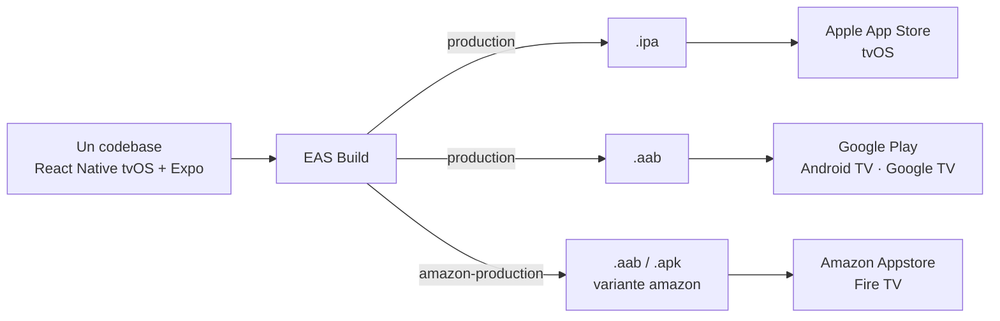

# EWTN+ para TV: una app de streaming para tres plataformas con un solo codebase

**Cómo construimos la app de TV de EWTN+ con React Native, qué problemas encontramos y cómo los resolvemos**

- Audiencia: equipo en general (no se asume experiencia en React Native ni en TV).
- Cada slide trae el contenido para pantalla y, debajo, notas del orador con tiempo sugerido y se separan con `---` y están numeradas y tituladas.

---

## 1. Portada

**EWTN+ para TV**
App de streaming para tres plataformas con un solo codebase: Apple App Store (tvOS), Google Play (Android TV / Google TV) y Amazon Appstore (Fire TV)

> **Notas del orador** ⏱ 0,5 min
>
> - Presentarse y presentar al equipo que trabajo en el proyecto
> - Resumir la charla y el objetivo de la charla: qué aprendimos y qué desafíos tuvimos construyendo una app de TV con React Native para Apple TV, Android TV y Fire TV en menos de 6 meses (29/07/2025 - 14/01/2026)
> - Tres stores implica tres procesos de revisión, tres formatos distintos de assets, tres formatos de buildeo y tres familias de dispositivos que se comportan totalmente diferente.

---

## 2. El cliente: EWTN

- Red católica global de medios: televisión, radio, noticias y plataformas digitales.
- Tenía una app de TV legacy con menos funcionalidades. Decidió construir una nueva desde cero.
- Producto: EWTN+ señales en vivo globales, emite 24/7 en inglés y español a audiencias de todo el mundo, catálogo on demand y la Biblia. Perfiles, guía de programación (EPG), búsqueda.

> **Notas del orador** ⏱ 1 min
>
> - Contexto del cliente: organización grande, con audiencia global
> - La app anterior cubría menos casos de uso. El objetivo fue una app nueva, con paridad entre plataformas y accesibilidad como requisito. La idea era pisar la app que ya tenian en la store y salir como si fuese un update, el problema es que nos lo comunicaron casi al momento de salir a producción.

---

## 3. La apuesta: un solo codebase

- Stack: React Native (fork `react-native-tvos`) + Expo, en TypeScript.
- El mismo código genera:
  - `.ipa` → Apple App Store / TestFlight (tvOS)
  - `.aab / .apk` (Android App Bundle) → Google Play, Amazon Appstore
- Builds y envíos en la nube con Expo Application Services (EAS): Cuatro identificadores de paquete Android (producción/staging × Play/Amazon) y un bundle iOS, todos desde el mismo árbol, resueltos por variables de entorno al evaluar la configuración.

> **Notas del orador** ⏱ 1,5 min
>
> - `react-native-tvos` es un fork de Reactn Native que le agrega soporte de tvOS y Android TV, y tiene algunas APIs que son experimentales y no soporta accesibilidad al 100% entonces hubo cosas que tuvimos que resolver con plugins o soluciones custom que no provee el fork en si. Lo que cambia por plataforma a nivel nativo se resuelve con config plugins de Expo [Buscar ejemplos de esto]
> - Por qué React Native: El cliente propuso esta tecnología por distintos motivos: una sola UI, un solo equipo chico con experiencia previa en React (evitando un equipo por aplicacion nativa) y con la idea de poder reutilizar codigo (todo se estructuro con una arquitectura pensada por este motivo, en un monorepo con mucha logica en carpetas compartidas) para la aplicación móvil, ya que pensaban que iba a ser muy similar, e incluso para compartir tambien con .com.
> - Distintos formatos de build aceptados por los stores. Hay GitHub Actions que triggerean las builds [Profundizar mas en esto, como funciona hoy en dia]

---

## 4. Desafíos

- Navegación, datos y estado se resuelven como en cualquier app React Native. El costo del proyecto se concentró en lo que es específico de TV y de este stack.
- Cinco grandes desafíos:
  1. **Manejo del foco.** En TV no hay mouse ni pantalla tactil: el foco es manejado con el D-pad del control remoto, y quién lo mueve es el motor nativo de cada OS (que actuan distinto).
  2. **Un solo codebase para tres plataformas.** tvOS, y Android (incluso entre dispositivos Google y Amazon) tienen muchas diferencias en cuanto a comportamientos relacionados a eventos y foco.
  3. **Lectores de pantalla.** VoiceOver y TalkBack duplican la matriz de pruebas y fallan de forma opuesta entre plataformas.
  4. **Falta de documentación.** En general hay muchas menos informacion sobre desarrollo de una App para TV (y especificamente en accesibilidad de TV) que para mobile o web, ademas usamos un fork poco mantenido y conocido. Las herramientas de AI no aportaban mucho al principio, hasta que se armó una base mas sólida con soluciones custom para que la AI tome de referencia.
  5. **Emuladores vs dispositivos físicos.** Foco, accesibilidad y rendimiento se comportan diferente entre hardware real y emuladores.
- Estos desafíos existen en cualquier app de TV, en este caso al tener un solo codebase fueron mas dificiles aun de resolver porque generalmente solucionar un problema para una plataforma podía causar otro problema en otra.

> **Notas del orador** ⏱ 1 min
>
> - Presentar los desafíos en general sin profundizar: Foco y accesibilidad son desafíos de TV que atraviesan todas las pantallas, y en este caso todas las plataformas

---

## 5. El foco

- En TV no hay mouse ni pantalla tactil: el **foco** se mueve con el D-pad del control remoto.
- Quién decide a dónde va el foco es el **motor nativo** de cada OS (UIKit en tvOS, FocusFinder en Android) a partir de la geometría del layout. Se decidio confiar en el motor nativo apoyado en `TVFocusGuideView` (API de react-native-tvos) para puentear y contener regiones.
- Síntomas recurrentes: foco que escapa al menú lateral durante transiciones; foco perdido tras cargas asíncronas; foco inicial en el elemento equivocado; pantallas sin ningún elemento focuseable; elementos superpuestos.

> **Notas del orador** ⏱ 1,5 min
>
> - Modelo mental: en web o móvil el usuario apunta; en TV el sistema calcula el "vecino más razonable" en la dirección pulsada.
> - Los diseños complejos (hero con overlays, menú lateral colapsable, grillas dentro de filas) son casos donde la geometría es ambigua, lo que genera ciertos problemas de foco, por ejemplo el menú lateral fue el gran imán de foco: cualquier instante sin un elemento focuseable en pantalla terminaba con el menú abierto.
> - Solucion: Componentes custom intentando aplicar la estrategia menos invasiva para evitar race condition entre focus: un placeholder focuseable durante los estados de carga, foco imperativo con reintentos, bloqueo del menú lateral durante la navegación.

---

## 6. Un solo codebase para tres plataformas

- Las APIs de react-native-tvos que venían a simplificar y unificar el tratado del focus para las distintas plataformas, estaban mal documentadas o funcionaban solo en una de las plataformas
- Las distintas plataformas manejan el foco y los eventos relacionados de forma distinta:

| Aspecto            | tvOS (Apple TV)                                                       | Android TV / Google TV                                                                                                 | Fire TV           |
| ------------------ | --------------------------------------------------------------------- | ---------------------------------------------------------------------------------------------------------------------- | ----------------- |
| Motor de foco      | Infiere destinos por posición y alineación; admite diagonales y swipe | El sistema busca el elemento más cercano en la dirección presionada (Arriba, Abajo, Izquierda, Derecha) sin diagonales | Igual que Android |
| Orden de eventos   | El esperado: blur del anterior, luego focus del nuevo                 | Focus del nuevo **antes** que blur del anterior                                                                        | Igual que Android |
| Lector de pantalla | VoiceOver                                                             | TalkBack                                                                                                               | VoiceView         |

- Consecuencia de un solo codebase: arreglar en una plataforma era propenso a romper otra. Muchas ramas condicionales por plataforma para aplicar distintas soluciones.

> **Notas del orador** ⏱ 1,5 min
>
> - Proximidad vs alineación: tvOS pondera mucho la alineación de bordes; Android busca el vecino más cercano en la dirección. Un mismo layout puede ser correcto en uno y ambiguo en el otro.
> - Ramas condicionales para cada plataforma.
> - Distintos comportamientos de los lectores de pantalla.

---

## 7. Lectores de pantalla

- El cliente require que hagamos mucho hincapie en accesibilidad.
- En TV, **el foco de accesibilidad puede diferir del foco de interacción** y el lector anuncia el elemento con foco de accesibilidad. La palanca de ritmo en los anuncios es la puntuación de las etiquetas
- Android + TalkBack: `TVFocusGuideView` se convierte en un nodo de accesibilidad y captura el foco. Hay que reemplazarlo por un contenedor plano y recablear a mano las trampas de foco que aportaba.
- tvOS + VoiceOver: no anuncia cuando el foco se mueve por código; se requieren anuncios explícitos, con demoras calibradas por pantalla, y la lectura se corta si coincide con actualizaciones de UI.
- Virtualización vs lector: para que TalkBack no salte ítems hay que mantenerlos montados, con costo en rendimiento.

> **Notas del orador** ⏱ 1,5 min
>
> - Con Screen Reader activado, el comportamiento del foco cambia, por ejemplo en Android el motor del SR oculta la captacion de botones y hace que dejemos de detectar que boton apreta en el control remoto por lo que nos exigio cambiar de estrategia por otras cosas como focus guard o el nextFocus.
> - El foco del SR en android puede pararse en textos pero en Apple No, por lo que tuvimos que hacer workarounds reemplazandolos por pressables para que el foco se puediera parar sobre el texto.
> - La accesibilidad duplicó la matriz de pruebas: Cada pantalla se valida en tres plataformas con y sin lector.
> - Las dos plataformas fallan de forma opuesta: Android exige quitar el componente que hace funcionar el foco; tvOS exige hablar cuando el sistema calla.
> - Solución: estado del lector en el contexto de foco; contenedor accesible y guardas de foco específicas de Android; política de PR con cuatro videos de evidencia (Apple y Android × lector on/off).

---

<!-- una Slide para ambos desafios que son mas cortos -->

## 8a. Falta de documentación

- `react-native-tvos` es un fork mantenido por pocas personas y con documentación escasa; el soporte de TV en Expo es experimental y depende de una variable de entorno y de un plugin de configuración.
- Huecos que hubo que cubrir con soluciones custom:
  - `react-native-video` no reporta cambios de bitrate en tvOS ni en streams solo de audio → módulos nativos propios en Swift y Kotlin, inyectados con config plugins.
  - Las dev builds de Expo necesitan el intent de launcher móvil, que una app de TV no debería declarar → el plugin lo elimina solo en release.

> **Notas del orador** ⏱ 1 min
>
> - Con este stack hay que asumir que el código fuente de la librería es la documentación.
> - Solucion: Hubo que aislar divergencias entre aplicaciones con config plugins defensivos (hoy son siete). Los config plugins permiten inyectar código nativo sin mantener carpetas nativas: se regeneran en cada build y, si el archivo esperado cambió, fallan con advertencia y no con error.

## 8b. Emuladores vs dispositivos físicos

- Apple TV HD (1080p) mostraba una línea vertical verde y errores de render de imágenes que el simulador nunca reprodujo.
- El VoiceOver de AppleTV solo se puede testear en dispositivo fisico.
- Fire TV no tiene emulador oficial: las pruebas se hacen por `adb` contra sticks físicos; VoiceView solo se puede probar en hardware.
- Entre el emulador de Android TV y un Google TV real cambian el timing del foco y el comportamiento del teclado del sistema.
- Los problemas de rendimiento (como lag del D-pad o demora al navegar) solo se ven en hardware real.

> **Notas del orador** ⏱ 1 min
>
> - Los emuladores sirven para desarrollar, no para validar: todo lo que involucra foco, lector de pantalla o rendimiento se decide en hardware.
> - El caso de Apple TV HD es un bug por modelo de dispositivo, invisible en simulador y en Apple TV 4K.
> - Los sticks de Fire TV son el hardware más limitado y el que mejor expone problemas de rendimiento.
> - Solucion: al menos un dispositivo físico por plataforma desde el inicio; evidencia en video por PR, lo que hace que el desarrollo sea mas pesado porque cada cambio exige que el desarrollador pruebe en los dispositivos fisicos.

---

## 9. Stack React Native tvOS + Expo: balance

**Ventajas**

- Un codebase y una sola UI para tres tiendas.
- Expo Router para navegación y EAS para builds y envíos: sin Xcode ni Gradle locales.
- Config plugins para expresar las divergencias nativas sin mantener carpetas `android/` e `ios/`.
- Ecosistema React Native aprovechable (reproductor, estado, validación) e iteración rápida con hot reload.
- Todo el equipo tenia experiencia previa en React
- Con la idea inicial, el stack nos daria ventaja para reutilizar mucha logica de negocios con la futura aplicacion mobile.

**Desventajas**

- El fork va detrás de React Native y de Expo; el soporte de TV es frágil.
- Documentación escasa.
- El motor de foco nativo obliga a condicionales por plataforma en toda la UI.
- E2E testing complejo.

> **Notas del orador** ⏱ 1,5 min
>
> - El balance sigue siendo positivo: Hoy la app esta en produccion y tres stores con un equipo pequeño no hubiera sido viable en nativo puro.
> - El costo se concentra en foco y accesibilidad; el resto de la app (navegación, datos, estado) no tuvo grandes inconvenientes.
> - Congelar dependencias fue una decisión deliberada para estabilizar; cada actualizacion de dependencia rompia componentes y focos, hay que planificarla pero antes establecer una buena base de E2E.

---

## 10. Alternativas que se podrían haber evaluado

| Alternativa                                             | A favor                                                               | En contra                                                            |
| ------------------------------------------------------- | --------------------------------------------------------------------- | -------------------------------------------------------------------- |
| Nativo puro (SwiftUI/UIKit + Compose for TV / Leanback) | Mejor foco y accesibilidad; APIs de primera mano                      | Dos bases de código y dos equipos; paridad de features costosa       |
| React Native + `react-tv-space-navigation`              | El foco se calcula en JS y se comporta igual en todas las plataformas | Se renuncia al foco nativo y a parte de la accesibilidad del sistema |
| Otras decisiones dentro de RN                           | FlashList en lugar de FlatList; bare RN tvOS en lugar de Expo         | Más control a cambio de más mantenimiento                            |

> **Notas del orador** ⏱ 1,5 min
>
> - La restricción decisiva es tvOS: descarta otras opciones existentes como Web para TV (Lightning.js, Solid, Vue) y Flutter.
> - La alternativa más interesante dentro del mismo stack es una librería de navegación espacial en JS: elimina las diferencias entre motores de foco, pero traslada la accesibilidad a la app. Con diseños complejos como los que teniamos, con elementos superpuestos, esa opción merece una prueba de concepto grande antes de decidir.
> - Unos meses después de haber lanzado la aplicación a producción, salió una guía completa sobre el desarrollo de aplicaciones de TV realizada por Callstack y Amazon y pudimos verificar que muchos de los problemas que menciona ese documento son exactamente los mismos con los que nos encontramos y que, en definitiva, pudimos resolver.

---

## 11. Cierre

- Una app, tres tiendas, un equipo pequeño: la apuesta funciona, con un costo concentrado en foco y accesibilidad.
- El motor de foco nativo y los lectores de pantalla son el verdadero "problema de TV"; el resto es desarrollo React Native convencional.
- Lo que no documenta upstream lo documenta el equipo, en código y en guías.
- E2E testing con Suitest para ayudar a detectar cualquier tipo de inestabilidad a tiempo.

**Preguntas**

> **Notas del orador** ⏱ 0,5 min
>
> - Cerrar charla y abrir preguntas.
> - [Conectar con la session que viene despues explicando como Suitest ayuda a aminorar todos estos desafíos que enfrentamos]

---
